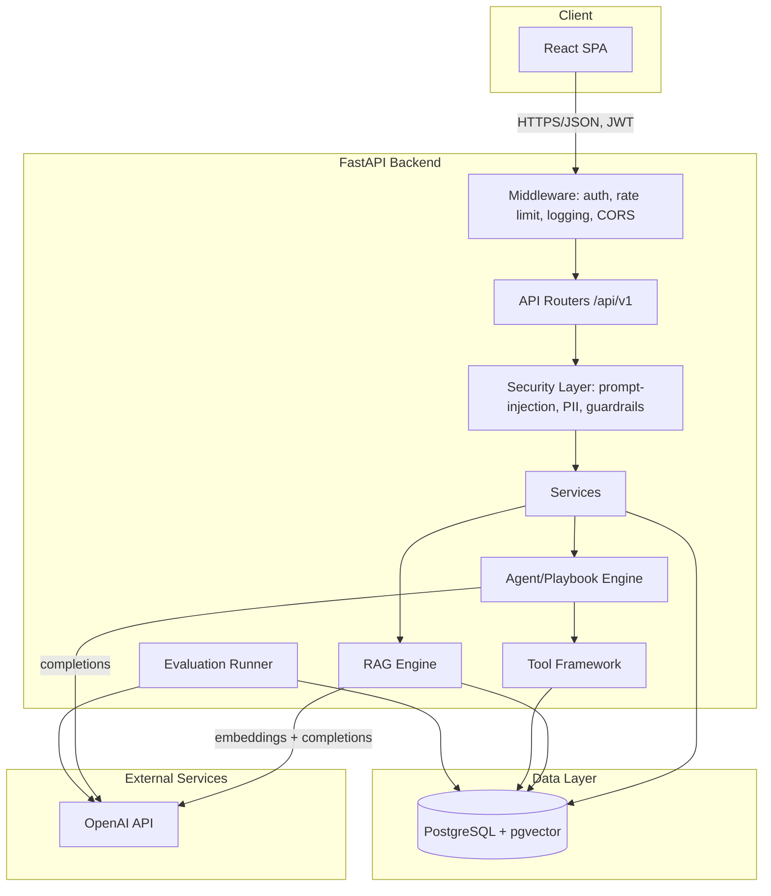
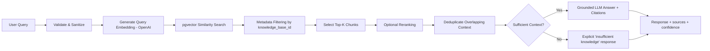
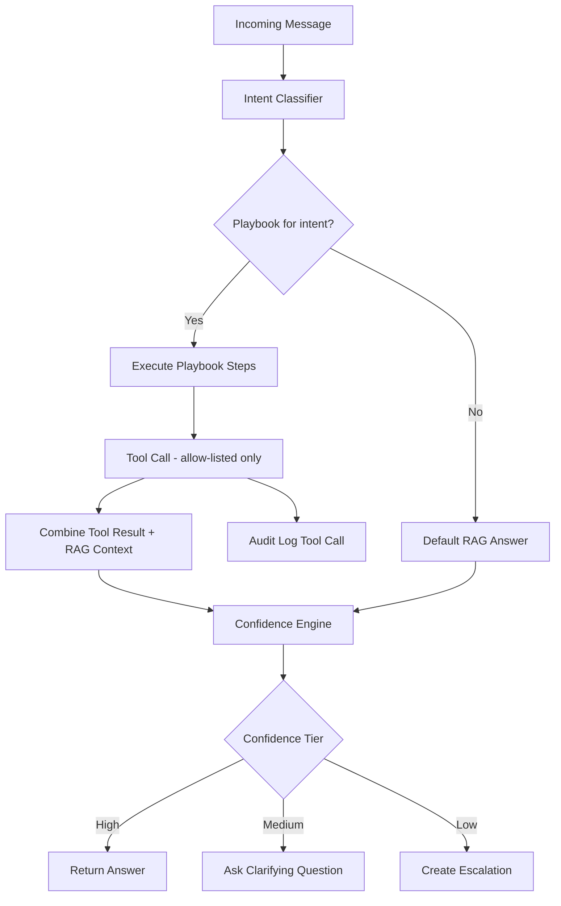
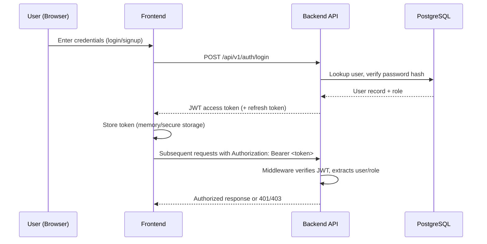
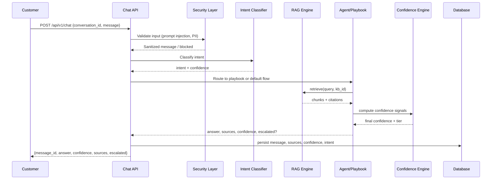
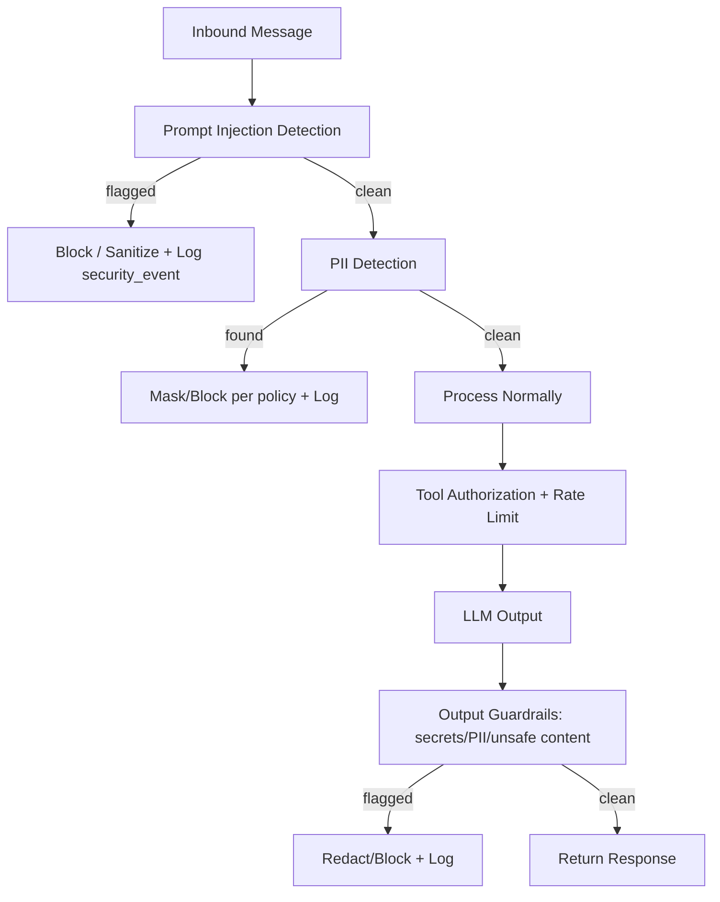
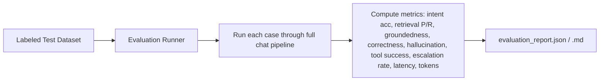

# Architecture — AICSP

## 1. System Overview

AICSP is a three-tier application:

- **Frontend**: React + TypeScript + Vite SPA, talking to the backend over REST (JSON), using React Query for data fetching/caching and Tailwind/shadcn for UI.
- **Backend**: Python FastAPI service exposing versioned REST APIs (`/api/v1/*`), organized into API routers, services (business logic), a RAG subsystem, an agent/playbook engine, a security layer, and an evaluation subsystem.
- **Database**: PostgreSQL with the `pgvector` extension for both relational data and vector similarity search (no separate vector DB needed).

## 2. System Architecture Diagram

## 3. RAG Pipeline

## 4. Agent / Playbook Execution

## 5. Authentication Flow

## 6. Conversation Flow

## 7. Security Pipeline

## 8. Evaluation Pipeline

## 9. Data Flow Summary

1. Client authenticates → JWT issued.
2. Client sends chat message → backend validates/sanitizes → intent classified.
3. Backend selects playbook (if intent matches) or default RAG flow.
4. RAG retrieves context from pgvector; agent may call allow-listed tools.
5. Confidence engine scores the result; low confidence triggers escalation.
6. Response + metadata persisted; structured log emitted.
7. Admin dashboard reads aggregated data directly from PostgreSQL via read APIs.

## 10. Security Boundaries

- All mutating/admin endpoints require JWT + role check (Admin/Agent as appropriate).
- The LLM never receives direct DB access or shell access — only through the Tool Framework's allow-listed, schema-validated functions.
- Document ingestion content is scanned for hidden instructions before being embedded/indexed.
- Secrets live only in environment variables (`.env`, never committed); `.env.example` documents required keys.

## 11. API Boundaries

All application endpoints are versioned under `/api/v1/`. See `docs/api-spec.md` for full contract definitions.
